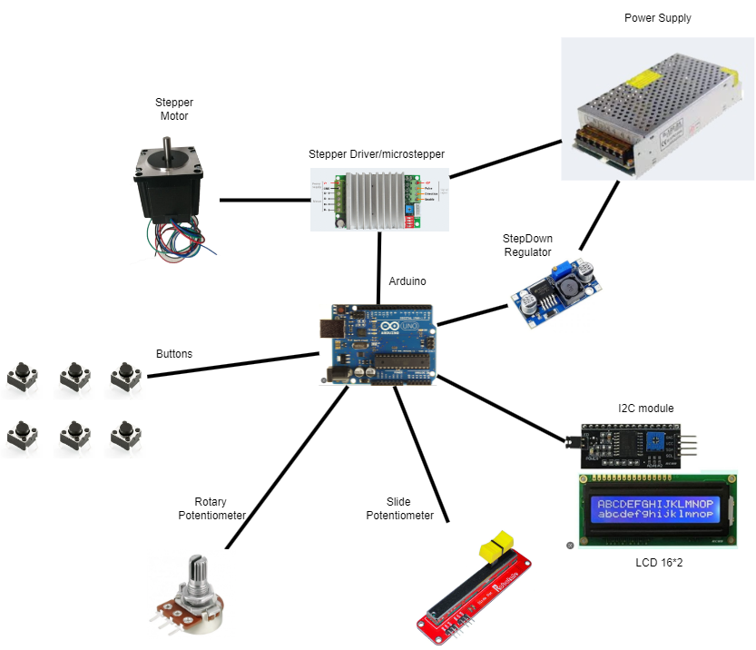
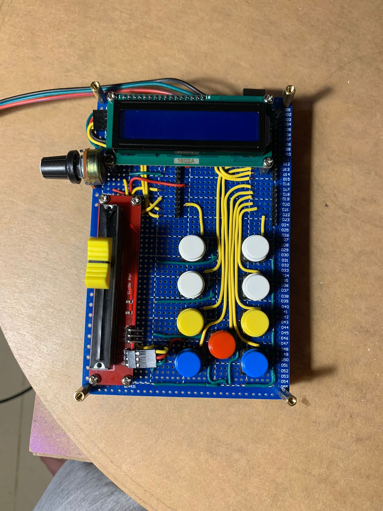

# Tunable Table

Tunable Table is an Arduino project, existed to create somehow a smart Lazy-Suzan table with the ability to control the rotation degree (in our case number of steps), number of rounds, speed & acceleration.

## Component 

 - [Arduino Uno](https://store.arduino.cc/products/arduino-uno-rev3)
 - [24v Power Supply](https://www.amazon.sa/-/en/inShareplus-Universal-Regulated-Switching-Transformer/dp/B08QRR6T2C/ref=sr_1_19?adgrpid=136301144115&gclid=Cj0KCQiA9YugBhCZARIsAACXxeLHV4wSVXXo8tjJQJFskXuigl66JRVDJwN3Jo1ySmAlSwpjvKoy76YaAiH-EALw_wcB&hvadid=592769682433&hvdev=c&hvlocphy=9076780&hvnetw=g&hvqmt=b&hvrand=13296055606170212126&hvtargid=kwd-16353386&hydadcr=9822_2205556&keywords=24v+dc+power+supply&qid=1677923950&sr=8-19)
 - [NEMA23 Stepper Motor](https://www.amazon.com/STEPPERONLINE-Stepper-178-5oz-1-26Nm-Stepping/dp/B00PNEPF5I)
 - [TB6600HG microstepper/driver](https://www.amazon.com/HiLetgo-TB6600HG-Stepper-Controller-Replace/dp/B01N6AIEQT/ref=sr_1_4_sspa?keywords=tb6600+stepper+motor+driver&qid=1677924171&sr=8-4-spons&psc=1&spLa=ZW5jcnlwdGVkUXVhbGlmaWVyPUExNTlNNVdHNFI2NEcyJmVuY3J5cHRlZElkPUExMDE1NjQ4TzYzVjFSQlA3TVk4JmVuY3J5cHRlZEFkSWQ9QTAxNDYxMTIyMFY0QVFVVzRLNjg0JndpZGdldE5hbWU9c3BfYXRmJmFjdGlvbj1jbGlja1JlZGlyZWN0JmRvTm90TG9nQ2xpY2s9dHJ1ZQ==)
 - [26*2 LCD with I2c module](https://www.amazon.com/JANSANE-Arduino-Display-Interface-Raspberry/dp/B07D83DY17/ref=sr_1_8?crid=1XDPGTXRW0QEN&keywords=16*2+lcd&qid=1677924296&sprefix=16+2+lcd%2Caps%2C209&sr=8-8)
 - [Slide Potentiometer](https://www.amazon.com/Ximimark-Linear-Potentiometer-Module-Analog/dp/B07HNY7VWC/ref=sr_1_6?keywords=slide+potentiometer&qid=1677924377&sprefix=slide+pot%2Caps%2C254&sr=8-6)
 - [Rotary Potentiometer](https://www.amazon.com/TWTADE-Adjustable-Potentiometer-Resistance-XH2-54-3P/dp/B082FCRQS2/ref=sr_1_3?crid=1YEQZB7T15K78&keywords=rotary+potentiometer&qid=1677924459&sprefix=rotary+potentiometer%2Caps%2C201&sr=8-3)
 - [Bush Buttons](ZW5jcnlwdGVkUXVhbGlmaWVyPUFTSTk0WEdVWTA0WFUmZW5jcnlwdGVkSWQ9QTA5NzEyNzIyUklFSkQxU1Q4N1BXJmVuY3J5cHRlZEFkSWQ9QTAxODE1MzkyUlNHMUpPTUdPOENCJndpZGdldE5hbWU9c3BfYXRmJmFjdGlvbj1jbGlja1JlZGlyZWN0JmRvTm90TG9nQ2xpY2s9dHJ1ZQ)
 - [Stepdown Regulator](https://www.amazon.com/Queta-Converter-Efficiency-Stabilizer-Transformer/dp/B08G4GYNL6/ref=sr_1_6?crid=1HYIEEKZG1R3B&keywords=step+down+regulator&qid=1677924670&sprefix=step+down+regulator%2Caps%2C211&sr=8-6)

## Libraries used

- AccelStepper.h
- LiquidCrystal_I2C.h

## Module Docs

[TB6600HG Datasheet](References/TB6600HG_datasheet_en_20160610.pdf)

[TB6600 Manual](References/tb6600manual.pdf)

[I2C_16*2-LCD](References/I2C_1602_LCD.pdf)

### Controller

